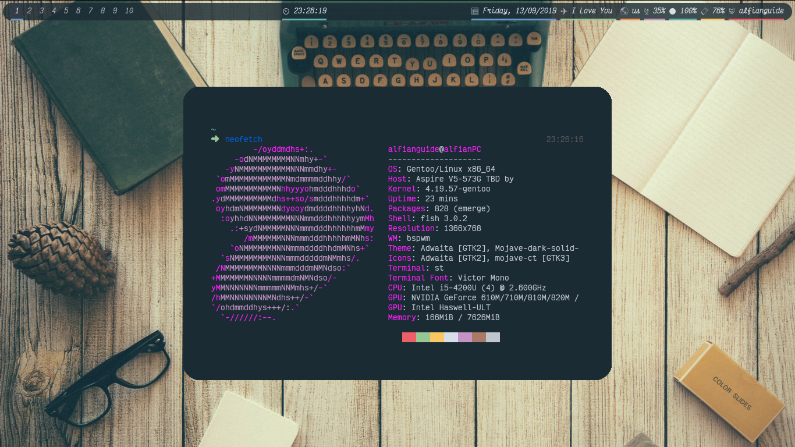

# dotFiles

My collections of dotFiles

[](LICENSE)

## Usage

Make a directory

```
mkdir $HOME/git
```

Change into created directory

```
cd $HOME/git
```

Clone this repository

```
git clone https://github.com/alfianguide/dotFiles
```

Once completed, change directory into it.

```
cd dotFiles
```

# MAKE SURE YOU BACKUP YOUR CONFIG EH

Copy .config folder into $HOME/.config

```
cp -r .config $HOME/.config
```

And the rest into it's respective folder. I know you know.

Or, I know you were advance, perhaps you wanna peek into my .vimrc heheh.

## Screenshots

Desktop



Vim

Under Construction

The Rest?

Check it yourself heheh

## Have Fun :)


## Self Notes

Never use obsolet/unmaintained/abandoned thing! if it's not work!
